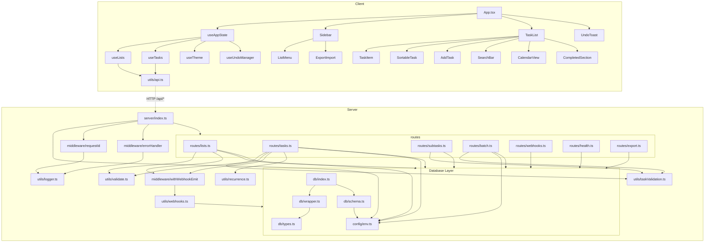

# ARCHITECTURE.md — TodoList Dependency Graph
> Derniere mise a jour : 2026-04-08

## Diagramme de Dependances Inter-Modules

## Points d'Entree (Entry Points)

| Entry Point | Type | Description |
|-------------|------|-------------|
| `server/index.ts` | HTTP Server | Express app, port configurable via `config.port` |
| `client/src/main.tsx` | React SPA | Vite-bundled, servi en statique par Express |
| `server/plugins/*.ts` | Auto-loaded | Chaque fichier exporte `{ router }`, monte sur `/api/*` |

## Effets de Bord Connus

| Module | Effet de bord | Impact |
|--------|--------------|--------|
| `db/wrapper.ts` | `setInterval(save, config.dbSaveInterval)` | Flush DB toutes les 5s |
| `db/wrapper.ts` | `process.on('SIGINT/SIGTERM', save)` | Graceful shutdown |
| `utils/webhooks.ts` | `fetch()` fire-and-forget | Echecs logues mais non-bloquants |
| `utils/logger.ts` | `fs.appendFileSync` | Ecriture synchrone sur disque |
| `middleware/requestId.ts` | `setTraceId()` | Mutation d'etat global du logger |
| `server/index.ts` | `app.listen()` | Bind port TCP |

## Contrats d'Interface Stables

Ces exports sont utilises par plusieurs modules et ne doivent **pas** etre renommes sans mettre a jour tous les consommateurs :

| Export | Module | Consommateurs |
|--------|--------|---------------|
| `db` (default) | `server/db/index.ts` | 8 route files + webhooks.ts |
| `config` | `server/config/env.ts` | index.ts, wrapper.ts, schema.ts, lists.ts, tasks.ts, batch.ts |
| `createLogger()` | `server/utils/logger.ts` | errorHandler, webhooks, schema, server/index |
| `findTask()` | `server/utils/taskValidation.ts` | tasks.ts, batch.ts, subtasks.ts |
| `nextPosition()` | `server/utils/taskValidation.ts` | tasks.ts, batch.ts, subtasks.ts |
| `withWebhookEmit()` | `server/middleware/withWebhookEmit.ts` | tasks.ts, lists.ts |
| `fetchJSON()` | `client/src/utils/api.ts` | useLists, useTasks, ExportImport, useAppState |
| `useAppState()` | `client/src/hooks/useAppState.ts` | App.tsx |
